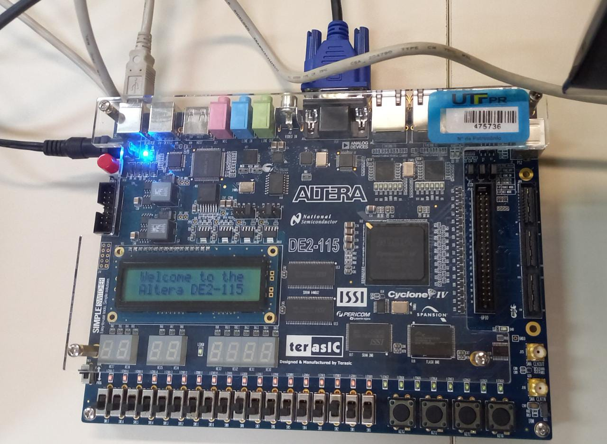

# Descrição

Programa em Verilog que cria simples animações em um monitor VGA (480x640) 

# Como rodar o programa

- Abrir o projeto pelo programa: **Quatus Prime Lite (20.1)**;

- Familia do dispositivo: **Cyclone IV E**;

- Dispositivo: **EP4CE115F29C7**

# Estrutura de arquivos:

- interface_vga

- pll

- controlador_vga

- movimenta_objetos

	- desenha_objeto
	
	- velocidade_objeto
	
	- desenha_obstaculo
	
	- colide_objeto
